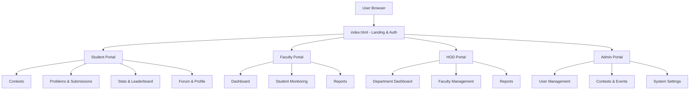

# 🎓 CampusCode – Integrated College Coding Platform

CampusCode is a modern, responsive frontend prototype for an integrated college portal designed to help students, faculty, and administrators collaborate, compete, and track coding progress.

It features a sleek UI with dark mode support, interactive charts, and a seamless user experience.

---

## 🚀 Key Features

### 1. Modern Landing Page
- **Hero Section:** Dynamic typewriter effect – *"Code, Compete, Collaborate"* with glassmorphism design  
- **Sliding Auth Modal:** Smooth sign-in/sign-up overlay with role-based redirection logic  
- **Responsive Navigation:** Sticky navbar with theme toggle and profile actions  

### 2. Student Dashboard & Stats
- **Visual Analytics:** Interactive charts (Skill Radar, Rating History, Language Usage) using Chart.js  
- **Activity Heatmap:** GitHub-style submission calendar to track daily coding streaks  
- **KPI Cards:** Quick view for current streak, max streak, and global ranking  

### 3. Contest System
- **Contest Overview:** List of upcoming, active, and past contests with countdowns and details  
- **Contest Arena:** Dedicated problem view with difficulty badges, success rates, and sorting  
- **Live Leaderboard:** Real-time ranking table with score breakdown per problem  

### 4. Community Forum
- **Discussion Board:** Category-based filtering (Web Dev, Algorithms, etc.) and search functionality  
- **Interactive Elements:** Tabbed filtering for *Most Recent*, *Most Active*, and *Unanswered* posts  

### 5. User Profile
- **Profile Management:** Edit profile modal with form validation  
- **Badges & Achievements:** Visual display of user accomplishments (e.g., *Fast Solver*, *Top 1%*)  
- **Sliding Stats Carousel:** Innovative horizontal scroll for detailed performance metrics  

---

## 🛠️ Tech Stack

- **Frontend Structure:** HTML5  
- **Styling:** Tailwind CSS (via CDN)  
- **Icons:** FontAwesome (via CDN)  
- **Charts & Graphs:** Chart.js  
- **Fonts:** Google Fonts (Poppins & JetBrains Mono)  
- **Scripting:** Vanilla JavaScript (ES6+)  

---

## 📂 Project Structure

```bash
prototype-campus-code/
├── ⚙️ .git/
├── 🛠️ .vscode/
├── 🏠 index.html
├── 📄 document.html
│
├── 🎓 student/
│   └── prototype/
│       ├── 🏁 index.html
│       ├── 🏆 contest.html
│       ├── 📋 contest_overview.html
│       ├── 🧩 contest-details.html
│       ├── 💬 forum.html
│       ├── ✍️ new-post.html
│       ├── ❓ problem_page.html
│       ├── 📚 problems.html
│       ├── 👤 profile.html
│       ├── 📊 report.html
│       ├── 📈 stats.html
│       ├── 📤 submission.html
│       ├── 🆘 support.html
│       └── 🧪 div.html
│
├── 🧑‍🏫 hod/
│   ├── 💬 community.html
│   ├── 🏆 contest.html
│   ├── 📊 dashboard.html
│   ├── 🧑‍🏫 faculty.html
│   ├── 🆘 help.html
│   ├── 🏁 index1.html
│   ├── ⚙️ index1_logic.js
│   ├── ❓ problem.html
│   ├── 👤 profile.html
│   ├── 📊 report.html
│   ├── ⚙️ setting.html
│   ├── 🎓 student.html
│   ├── 📦 shared/
│   └── 🎨 styles/
│
├── 👨‍🏫 faculty/
│   ├── 💬 community.html
│   ├── 🏆 contest.html
│   ├── 📊 dashboard.html
│   ├── 🏁 index1.html
│   ├── ⚙️ index1_logic.js
│   ├── ❓ problem.html
│   ├── 📊 report.html
│   ├── 📑 reports1.html
│   ├── 🎓 student.html
│   ├── 📦 shared/
│   ├── 🎨 styles/
│   └── 🧪 x.html
│
└── 👑 admin/
    ├── 🏆 contest.html
    ├── 📑 contest-report.html
    ├── 📊 dashboard.html
    ├── 📅 events.html
    ├── 🆘 help_support.html
    ├── 👥 manage_user.html
    ├── 👤 profile.html
    ├── 🧠 program.html
    └── ✏️ update-report.html

```
⚡ How to Run

Since this is a static frontend prototype, no backend server or installation is required.

1. Clone the repository
```
git clone https://github.com/rupambhardwaj4/prototype-campus-code-.git
```
3. Navigate to the project folder
```
cd prototype-campus-code-
```
5. Open index.html

Simply double-click index.html to open it in your browser.

✅ Recommended: Use the Live Server extension in VS Code for the best experience.

👥 Role-Based System Overview

1.🎓 Student
Participate in contests & solve coding problems
Track progress using stats dashboard & heatmap
View leaderboard rankings
Manage profile & submissions
Use community forum & support system

2.👨‍🏫 Faculty
Monitor student performance & submissions
View contest analytics & reports
Manage academic problem sets
Access faculty dashboard & community panel

3.🧑‍🏫 HOD (Head of Department)
Department-level analytics dashboard
Faculty monitoring & management
Student performance overview
Contest supervision & reporting
System configuration access

4.👑 Admin
Full system control
Manage users (students, faculty, HODs)
Create & manage contests & events
System reports & updates
Platform configuration & moderation

🎨 UI Highlights
- Feature	Description
- Dark Mode	Fully integrated dark/light theme toggle saved to LocalStorage
- Glassmorphism	Modern frosted glass effects on modals and navbars
- Micro-interactions	Smooth transitions, hover effects, and animated modals

## 🧩 Component Diagram

```mermaid
graph LR
    U[User Browser]

    L[index.html<br/>Landing + Auth UI]
    R[Role Router<br/>(JavaScript)]

    S[Student Module]
    F[Faculty Module]
    H[HOD Module]
    A[Admin Module]

    UI[Shared UI Components<br/>Dashboard • Contest • Stats • Forum • Profile]

    U --> L
    L --> R

    R --> S
    R --> F
    R --> H
    R --> A

    S --> UI
    F --> UI
    H --> UI
    A --> UI
```

## 🧱 System Architecture 



# 🎓 CampusCode – Integrated College Coding Platform
<p align="center">
  
  
  
  
  
</p>
<!-- Tech Stack Badges -->
<p align="center">
  
  
  
  
  
  
</p>

This project is a frontend prototype developed for educational and demonstration purposes only.
